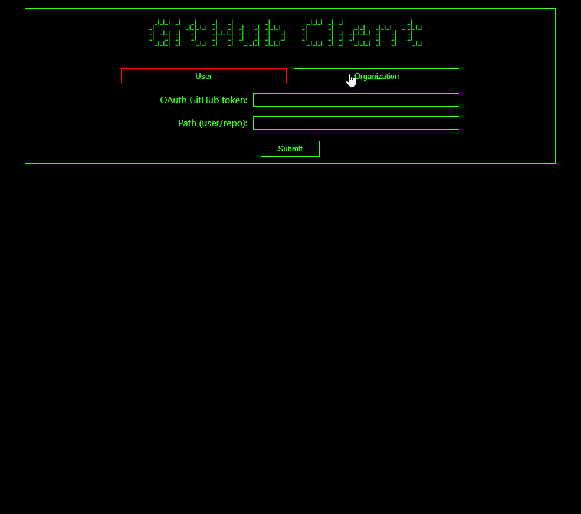
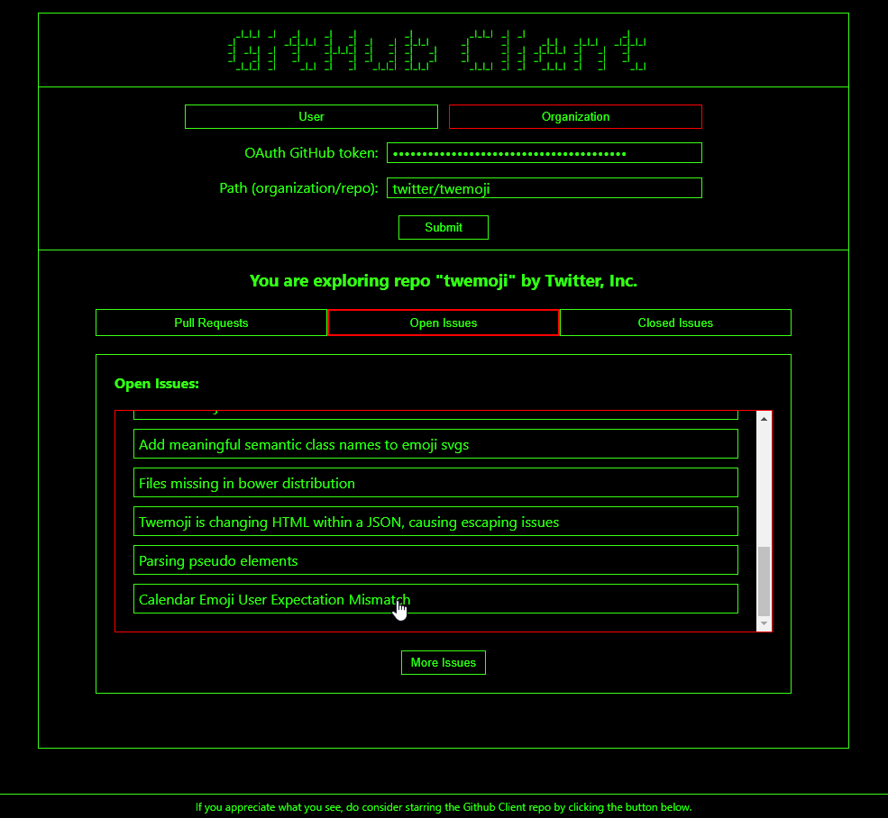

# GitHub Client

## Demo

https://github-client.petartzar80.now.sh/

Try it out!

## Preview





## Description

A single page React app communicating with GitHub GraphQL API v4, which displays following information regarding a chosen organization or user repository:

- a paginated list of pull requests
- a paginated list of open issues
- a paginated list of closed issues

Clicking on an issue displays a detailed view of the issue including:

- a list of corresponding comments related to this issue in chronological order
- a search box for filtering comments

There's one cheeky mutation included, too! 

In order to utilize the app, user is required to enter his personal GitHub OAuth token and a path to chosen repository (format: account/repo) via corresponding text input fields. 

## Utilization

Clone this project and install dependencies:

```bash
$ git clone https://github.com/petartzar80/github-client.git
$ cd github-client
$ npm install
```

Start the project with:

```bash
$ npm start
```
To use this app, you need to generate a personal access token on GitHub website. [Follow the instructions](https://help.github.com/en/github/authenticating-to-github/creating-a-personal-access-token-for-the-command-line) to obtain it and check the necessary scopes (repo, user). Enter the token in the required field.

Finally, enter the path to the chosen repository in the corresponding field. The format is: account/repo (eg. nuwave/lighthouse).
